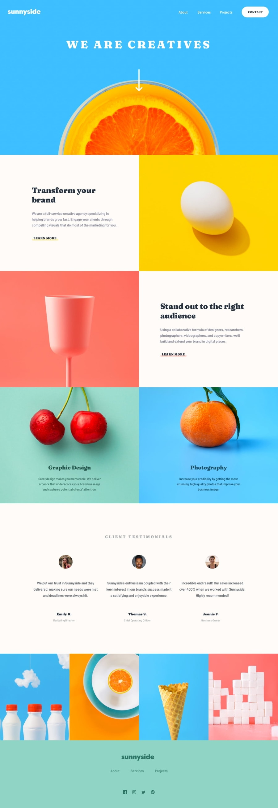

# Sunnyside Agency Replica

- checkout the live link : [here](https://sunnyside-agency-replica.netlify.app/) 

## Table of contents

- [Overview](#overview)
  - [The challenge task](#the-challenge)
  - [Screenshot](#screenshot)
- [My process](#my-process)

## Overview

### The challenge task

Users should be able to:

- [x] View the optimal layout for the site depending on their device's screen size
- [x] See hover states for all interactive elements on the page

### Screenshot

My Process
--------------
> Build with

- Semantic HTML5 markup
- Css Custom Properties
- Flexbox 
- Css Grid
- Desktop-first Workflow
- Vanilla JS

> Fonts

- "Fraunces",serif
- "Barlow",sans-serif
